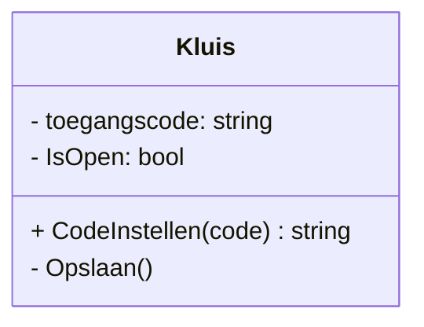

# De kluis

Het document beschrijft het ontwerp van een eenvoudige digitale kluis. Het doel is om helder vast te leggen welke functionaliteit de kluis moet ondersteunen en welke eisen aan deze functionaliteit worden gesteld. Het ontwerp richt zich op het perspectief van de gebruiker en vormt de basis voor een latere technische uitwerking.

In dit document worden de user story, use-cases en functionele requirements uitgewerkt. Samen geven zij een gestructureerd beeld van wat de kluis moet kunnen en welke informatie daarvoor nodig is. Dit ontwerp dient als uitgangspunt voor de implementatie, maar legt nog niet vast hoe de oplossing technisch wordt gerealiseerd. Hierdoor blijft het ontwerp breed toepasbaar en geschikt voor verschillende programmeertalen en technologieën.

------

[TOC]

------

## Requirements

### UC1: Code instellen

| ID   | Requirement                                                  | Type | Bron / Use-case | Ontwerpverwijzing            | Testverwijzing |
| ---- | ------------------------------------------------------------ | ---- | --------------- | ---------------------------- | -------------- |
| R1   | De eigenaar kan een nieuwe toegangscode invoeren.            | F    | UC1             | Code instellen               | TC1            |
| R2   | De ingevoerde toegangscode wordt gevalideerd op geldigheid.  | F    | UC1             | Validatieregels code         | TC2            |
| R3   | De nieuwe toegangscode wordt opgeslagen als actuele code van de kluis. | F    | UC1             | Datamodel code               | TC3            |
| R4   | De eigenaar ontvangt een bevestiging dat de toegangscode is ingesteld. | F    | UC1             | Feedbackmeldingen            | TC4            |
| R18  | Een toegangscode moet voldoen aan vooraf vastgelegde criteria, zoals minimale lengte en toegestane tekens. | F    | UC1             | Validatieregels toegangscode | TC2            |

### UC2: Kluis openen

| ID   | Requirement                                                  | Type | Bron / Use-case | Ontwerpverwijzing            | Testverwijzing |
| ---- | ------------------------------------------------------------ | ---- | --------------- | ---------------------------- | -------------- |
| R5   | De eigenaar voert een toegangscode in om de kluis te openen. | F    | UC2             | Interactie kluis openen      | TC5            |
| R6   | De ingevoerde toegangscode wordt vergeleken met de opgeslagen code. | F    | UC2             | Validatieregels codecontrole | TC6            |
| R7   | De kluis wordt geopend wanneer de toegangscode overeenkomt.  | F    | UC2             | Statusmodel kluis            | TC7            |
| R8   | De eigenaar ontvangt een foutmelding wanneer de toegangscode niet klopt. | F    | UC2             | Feedbackmeldingen            | TC8            |

### UC3: Voorwerpen plaatsen

| ID   | Requirement                                                  | Type | Bron / Use-case | Ontwerpverwijzing  | Testverwijzing |
| ---- | ------------------------------------------------------------ | ---- | --------------- | ------------------ | -------------- |
| R9   | Voorwerpen kunnen alleen geplaatst worden wanneer de kluis geopend is. | F    | UC3             | Statusmodel kluis  | TC9            |
| R10  | De eigenaar kan een of meerdere voorwerpen toevoegen aan de kluisinhoud. | F    | UC3             | Kluisinhoud – CRUD | TC10           |
| R11  | De bijgewerkte inhoud van de kluis wordt vastgelegd.         | F    | UC3             | Datamodel – inhoud | TC11           |
| R12  | De eigenaar ontvangt een bevestiging dat de voorwerpen zijn geplaatst. | F    | UC3             | Feedbackmeldingen  | TC12           |

### UC4: Voorwerpen pakken

| ID   | Requirement                                                  | Type | Bron / Use-case | Ontwerpverwijzing  | Testverwijzing |
| ---- | ------------------------------------------------------------ | ---- | --------------- | ------------------ | -------------- |
| R13  | Voorwerpen kunnen alleen gepakt worden wanneer de kluis geopend is. | F    | UC4             | Statusmodel kluis  | TC13           |
| R14  | De eigenaar kan voorwerpen selecteren en verwijderen uit de kluisinhoud. | F    | UC4             | Kluisinhoud – CRUD | TC14           |
| R15  | De aangepaste kluisinhoud wordt vastgelegd.                  | F    | UC4             | Datamodel – inhoud | TC15           |
| R16  | De eigenaar ontvangt een bevestiging dat de voorwerpen succesvol zijn gepakt. | F    | UC4             | Feedbackmeldingen  | TC16           |

### UC5: Kluis sluiten

| ID   | Requirement                                  | Type | Bron / Use-case | Ontwerpverwijzing | Testverwijzing |
| ---- | -------------------------------------------- | ---- | --------------- | ----------------- | -------------- |
| R17  | De kluis kan worden gesloten en vergrendeld. | F    | UC5             | Statusmodel kluis | TC17           |

## Userstory

Roy Mengelers is verantwoordelijk voor de uitwerking van US1.

### US1: Kluis beheren

| ID   | User Story                                                   | Acceptatiecriteria                                           | Verwijzing Requirements | Verwijzing Ontwerp                        |
| ---- | ------------------------------------------------------------ | ------------------------------------------------------------ | ----------------------- | ----------------------------------------- |
| US1  | Als eigenaar van de kluis wil ik een persoonlijke toegangscode kunnen instellen, de kluis kunnen openen en sluiten, en voorwerpen kunnen plaatsen of pakken, zodat mijn spullen veilig opgeborgen zijn. | Een code kan worden ingesteld; de kluis kan worden geopend met de juiste code; voorwerpen kunnen worden geplaatst; voorwerpen kunnen worden gepakt; de kluis kan worden gesloten; de kluis blijft beveiligd wanneer deze gesloten is. | R1 t/m R17              | Ontwerp Kluiscomponent + Use-Case Diagram |

------

# Software ontwerp

## Usecase-Diagram

Onderstaand usecase-diagram geeft een duidelijk beeld wat een eindgebruiker in dit geval de eigenaar kan met de digitale variant van een kluis. 

## Usecase-Beschrijving

### Use case-overzicht UC1

| Veld           | Beschrijving                                                 |
| -------------- | ------------------------------------------------------------ |
| Use case ID    | UC1                                                          |
| Naam           | Code instellen (toegangscode invoeren)                       |
| Doel           | De eigenaar stelt een (nieuwe) toegangscode in voor de kluis. |
| Primaire actor | Eigenaar                                                     |
| Stakeholders   | Eigenaar (wil veilige toegang); eventuele gebruikers van de kluis |
| Trigger        | De eigenaar wil een nieuwe of andere toegangscode instellen. |
| Precondities   | De eigenaar heeft toegang tot de kluisfunctionaliteit.       |
| Postcondities  | Er is een geldige toegangscode ingesteld en opgeslagen.      |

---

### 2. Scenario 1 – Happy flow: nieuwe geldige code instellen

| Stap | Actor    | Actie                                                        | Reactie / Resultaat                                          |
| ---- | -------- | ------------------------------------------------------------ | ------------------------------------------------------------ |
| 1    | Eigenaar | Kiest de optie **"Code instellen"**.                         | Het systeem toont een scherm om een nieuwe toegangscode in te voeren. |
| 2    | Eigenaar | Voert een nieuwe toegangscode in en bevestigt.               | De ingevoerde code wordt tijdelijk vastgehouden voor validatie. |
| 3    | Systeem  | Valideert de code (bijvoorbeeld lengte en toegestane tekens). | De code blijkt geldig.                                       |
| 4    | Systeem  | Slaat de nieuwe toegangscode op als actuele code van de kluis. | De oude code wordt vervangen door de nieuwe code (of er was nog geen oude code). |
| 5    | Systeem  | Geeft een bevestiging terug aan de eigenaar.                 | De eigenaar ziet een melding: **"Toegangscode succesvol ingesteld."** |

Resultaat: de kluis heeft nu een geldige toegangscode en is klaar om later mee te openen.

---

### 3. Scenario 2 – Alternatieve flow: eerste keer code instellen (nog geen bestaande code)

| Stap | Actor    | Actie                                                        | Reactie / Resultaat                                          |
| ---- | -------- | ------------------------------------------------------------ | ------------------------------------------------------------ |
| 1    | Eigenaar | Start de applicatie en kiest **"Code instellen"** bij eerste gebruik. | Het systeem herkent dat er nog geen toegangscode is opgeslagen. |
| 2    | Systeem  | Vraagt de eigenaar om een nieuwe code in te voeren.          | Er wordt een invoerveld voor de toegangscode getoond.        |
| 3    | Eigenaar | Voert een nieuwe toegangscode in en bevestigt.               | De ingevoerde code wordt gevalideerd.                        |
| 4    | Systeem  | Slaat de nieuwe code op als eerste toegangscode van de kluis. | Er is nu een geldige code aanwezig.                          |
| 5    | Systeem  | Toont een bevestigingsmelding aan de eigenaar.               | De eigenaar weet dat de kluis nu beveiligd is met de gekozen code. |

Resultaat: de kluis gaat van “onbeveiligd” naar “beveiligd met eerste toegangscode”.

---

### 4. Scenario 3 – Alternatieve flow: eigenaar annuleert het instellen van de code

| Stap | Actor    | Actie                                                      | Reactie / Resultaat                                          |
| ---- | -------- | ---------------------------------------------------------- | ------------------------------------------------------------ |
| 1    | Eigenaar | Kiest de optie **"Code instellen"**.                       | Het systeem toont het scherm voor het invoeren van een nieuwe code. |
| 2    | Eigenaar | Begint met invoeren van een nieuwe code.                   | De code wordt nog niet definitief opgeslagen.                |
| 3    | Eigenaar | Bedenkt zich en kiest **"Annuleren"** of sluit het scherm. | Het systeem stopt het instelproces.                          |
| 4    | Systeem  | Keert terug naar het hoofdscherm of vorig menu.            | Er wordt **geen wijziging** aangebracht in de bestaande toegangscode. |

Resultaat: de bestaande situatie blijft ongewijzigd; er is geen nieuwe code ingesteld.

---

### 5. Scenario 4 – Foutscenario: ongeldige code invoeren

| Stap | Actor    | Actie                                                        | Reactie / Resultaat                                          |
| ---- | -------- | ------------------------------------------------------------ | ------------------------------------------------------------ |
| 1    | Eigenaar | Kiest de optie **"Code instellen"**.                         | Het systeem toont het scherm voor het invoeren van een nieuwe code. |
| 2    | Eigenaar | Voert een ongeldige toegangscode in (bijv. te kort of leeg). | De invoer wordt doorgestuurd voor validatie.                 |
| 3    | Systeem  | Valideert de code volgens de afgesproken regels.             | De code blijkt **ongeldig** (bijv. te weinig tekens of niet-toegestane tekens). |
| 4    | Systeem  | Toont een duidelijke foutmelding aan de eigenaar.            | De eigenaar ziet bijvoorbeeld: **"Code ongeldig, voer minimaal 4 cijfers in."** |
| 5    | Systeem  | Biedt de mogelijkheid om de code opnieuw in te voeren of te annuleren. | De eigenaar kan het opnieuw proberen of het proces beëindigen. |
| 6    | Systeem  | Laat de bestaande code onveranderd.                          | De eerder ingestelde toegangscode blijft actief.             |

Resultaat: er is geen nieuwe code ingesteld; de eigenaar wordt gewezen op de fout en kan corrigeren.

## Lo-fi design

Omdat we met een console applicatie werken is gekozen voor een Lo-fi design dat aansluit op een mogelijke implementatie zoals in onderstaand voorbeeld. 

 

## Klassendiagram

------

# Database ontwerp

## Entity relation diagram (ERD)

## Logische gegevens structuur (LGS)

## Data dictionary (DD)